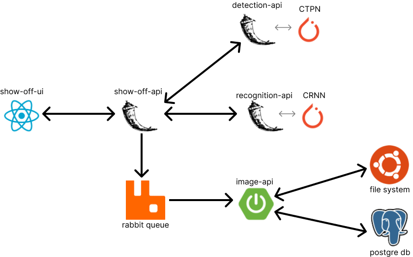
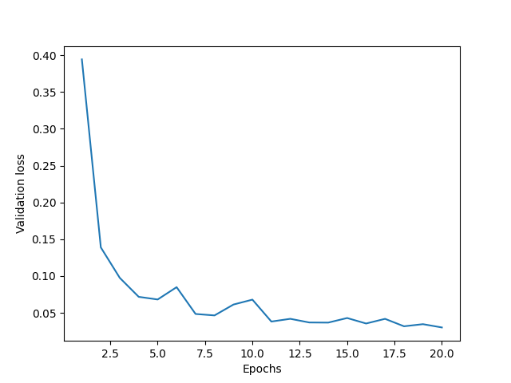
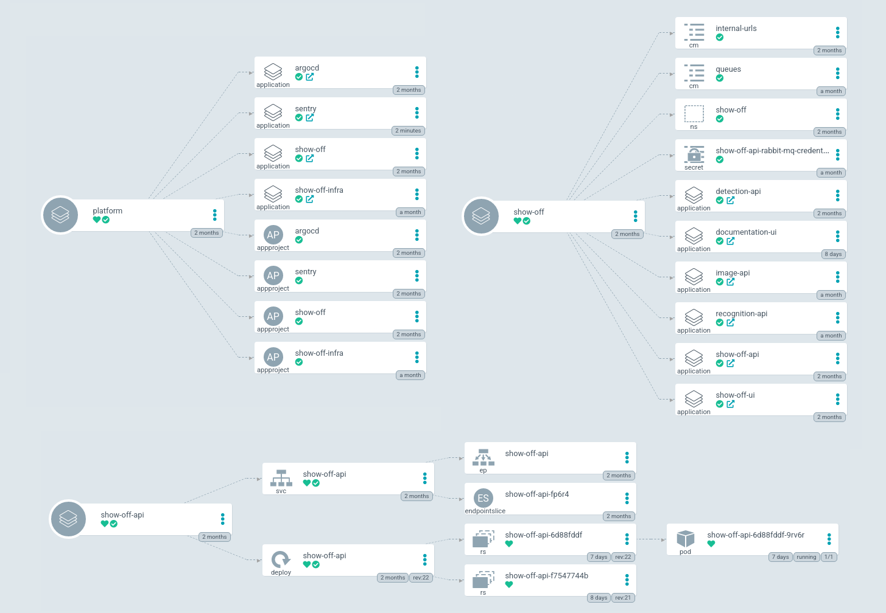
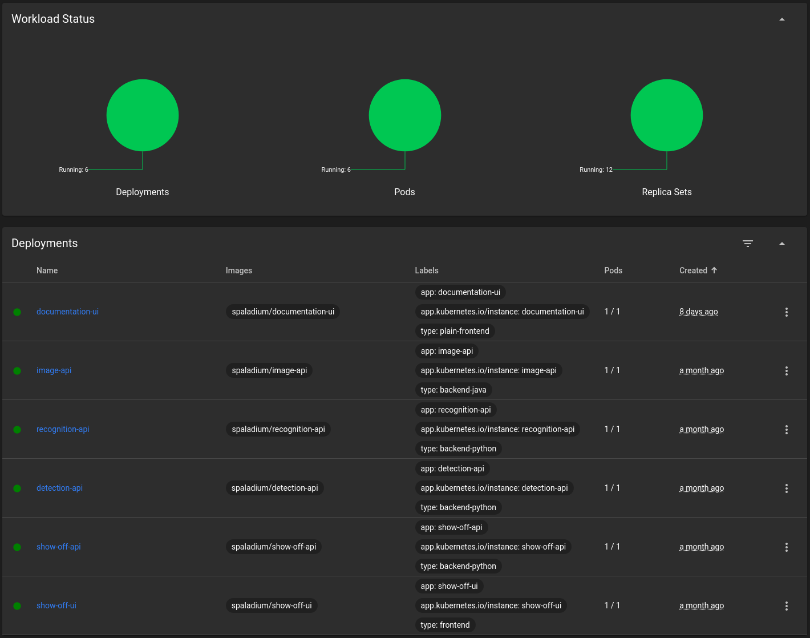
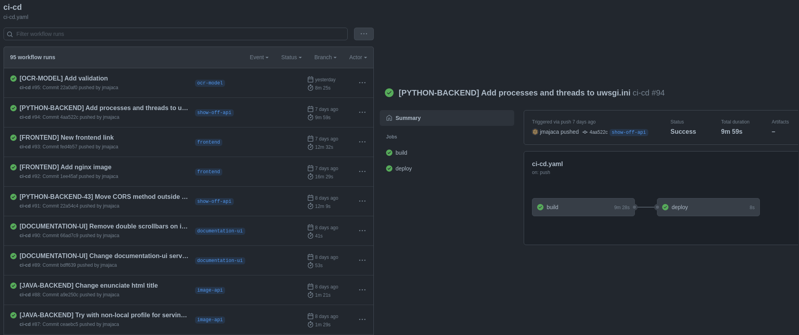
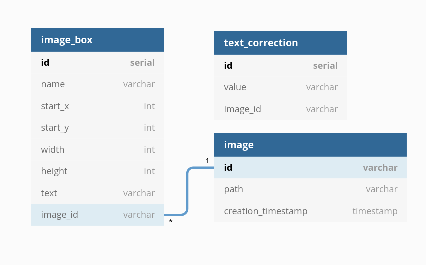

# Project: **show-off**

   
   
    
    

## About

This project is created for showing off and experimenting with my skills in the fields of Software Development, Machine Learning, and DevOps.

Implemented system and applications are reading text from supplied images and returning extracted text from images. In essence, this is an OCR application.

Application and its Kubernetes cluster are hosted on Oracle Cloud ARM architecture server. The application itself can be found at
[jmajaca.xyz/show-off](https://jmajaca.xyz/show-off). While APIs documentation is available [here](https://jmajaca.xyz:5000/).

> Note: The model for recognition of text from an image is under-performing mostly because of the dataset used to train it.
> As the recognition model was not the main focus of this project (it was the whole system) I decided to release the project 
> and repo to the public. Currently, I am trying to optimize the performance of the recognition model.

## Architecture



## Models

I decided to break the OCR task into two sequential tasks: detection of text in image and recognition of words/characters on detected text.

For detection CTPN model is used and for recognition CRNN model is used.

### Connectioinst Text Proposal Network ([CTPN](https://arxiv.org/abs/1609.03605)) Model

This model can extract regions of text from supplied image. For my implementation, I used existing implementations written with Pytorch.
From said implementation, all was "scraped" except the necessary parts of code for prediction.
Alongside implementation, pretrained weights were also
downloaded from supplied GitHub repo. It was decided that this approach would be the best considering amount of pre-
and post-processing of data required for
this model. The fact that this project tries to implement the whole system as opposed to one model also played a role in the decision.

Using someone else's implementation proved to be excellent in the context of time needed to develop the whole system but pretty bad in the context of speed.
In the original paper, the authors claim that "the CTPN is computationally efficient with 0.14 s/image" while the current implementation takes about 8 seconds per image
(with post- and pre-processing). One future improvement is to implement the model myself and optimize its time per image.

Source code can be found in folder `detection/python/src/third_party`.

### Convolutional Recurrent Neural Network ([CRNN](https://arxiv.org/abs/1507.05717)) Model

This model can extract text from supplied image. Implementation was done with help of the original paper and existing implementations
like one discussed in [this blog](https://deepayan137.github.io/blog/markdown/2020/08/29/building-ocr.html).

The model was trained on a synthetic dataset and has poor generalization ability. Currently, the process of searching for the desired
dataset is in progress. In the meantime, weights trained on the synthetic dataset are in use only to show the whole system that
was designed.

The image below shows the value of the loss function over epochs for the validation dataset. Training stopped when validation loss
was greater than in the last 5 epochs. The size of the validation loss window is a hyperparameter of the optimization process.




Source code can be found in folder `recognition/python/model`.

## Microservices

| Name                 | Description                                                                | Language   | Framework   | Source code folder       |
|----------------------|----------------------------------------------------------------------------|------------|-------------|--------------------------|
| **show-off-ui**      | Frontend application that sends images to OCR process and displays results | TypeScript | React       | `show-off-ui`            |
| **show-off-api**     | Backend for Frontend (BFF) application                                     | Python     | Flask       | `show-off-api/python`    |
| **show-off-api-go**  | Backend for Frontend (BFF) application written in Golang                   | Go         | -           | `show-off-api/golang`    |
| **detection-api**    | CTPN Model wrapper for REST calls                                          | Python     | Flask       | `detection/python`       |
| **recognition-api**  | CRNN Model wrapper for REST calls                                          | Python     | Flask       | `recognition/python/api` |
| **image-api**        | Application that stores images and image data                              | Java       | Spring Boot | `image-api`              |
| **documentation-ui** | Frontend application for viewing documentation from all APIs at one place  | JavaScript | -           | `documentation-ui`       |

### show off ui

Frontend application implemented in TypeScript and React Framework. Its main task is sending images to the backend and representing the backend's response.

Before sending the image to the backend via network application will resize an image to have a height of `720px` while the image maintains
width to height ratio. The image will be also converted to `jpeg` format before being sent as `multipart/form-data`. All
that ensures reduction of network traffic without significant (if any) loss of data. This could be further improved by
providing an option for a user to explicitly mark his region of interest on the photo so that only the marked rectangle will be sent
to the backend (after compression). User marking a region of an image before sending it is in time of writing this marked as TODO task.

### show off api

The application is designed as a Backend for the Frontend. Its main task is to dispatch requests (after processing them) on
other APIs when a request is received from the frontend.

Other services with which this application interacts are detection-api and recognition-api for synchronous calls and
three queues for asynchronous calls. If one of the synchronous calls fails the whole process fails and if one asynchronous
process fails it will have no impact on the process itself. Asynchronous calls on queues are used to store data about
an image and its data in form of text placement and extraction.

Implementation is created with Python and Flask (`show-off-api` image) and with Go (`show-off-api-go` image). Both implementations
have the same endpoints and logic. In front of these two instances lies the nginx load balancer `show-off-api-lb` which uses
the round-robin method for forwarding requests to APIs.

Documentation of API endpoints can be found [here](https://jmajaca.xyz:5000/#show-off-api).

### detection api

The application is a wrapper for the detection model which exposes relevant endpoints via REST.

In the future wrapper implementation in Golang is considered.

Documentation of API endpoints can be found [here](https://jmajaca.xyz:5000/#detection-api).

### recognition api

The application is a wrapper for the recognition model which exposes relevant endpoints via REST.

In the future wrapper implementation in Golang is considered.

Documentation of API endpoints can be found [here](https://jmajaca.xyz:5000/#recognition-api).

### image api

The application that handles saving the image and its corresponding data.

Image and data are received via a queue. There exist some methods exposed via REST API, but that is only for showing off.
The image itself is stored on the filesystem while the data received during the OCR process is stored in the database. There exists cron
job responsible for deleting images and image-related data if they are older than N=7 days.

Documentation of API endpoints can be found [here](https://jmajaca.xyz:5000/#image-api).

### documentation-ui

Frontend application implementation in plain JavaScript with no Framework. It uses one HTML file and one nginx configuration
for reverse proxy. Via this application one can see all API docs in one place.

Application can be found [here](https://jmajaca.xyz:5000).

## CI-CD

The complete pipeline is created that handles build and deployment to the server on every push to one of the target branches.
All runs of the pipeline can be seen in the projects [actions](https://github.com/jmajaca/show-off/actions) tab.
The product of the build process is a Docker image which is published to [DockerHub](https://hub.docker.com/u/spaladium).

### Argo

ArgoCD is used for GitOps-ing Kubernetes resources. More information about this concrete implementation and use of
ArgoCD can be found [here](https://github.com/jmajaca/show-off/blob/master/devops/README.md).



### Minikube

Minikube is used for operating the Kubernetes cluster. Three namespaces are created: show-off, show-off-infra, and argo.
In argo namespace, ArgoCD is installed, in show-off-infra rabbit queue and Postgres database are located while all other
microservices are in show-off namespace.



### GitHub Actions

GitHub actions are used for CI-CD. There exists one `yaml` file for declaring the build and deploy process for every
microservice which is triggered when the branch associated with that microservice receives a new commit. YAML file can be
found [here](https://github.com/jmajaca/show-off/blob/master/.github/workflows/ci-cd.yaml).



## Infra

### Queue

There exists 3 queues: imageQueue, imageDataQueue and textCorrectionQueue. All queues have header with `request_id` parameter.

imageQueue takes binary data that represents an image. imageDataQueue takes JSON with data from the OCR process which contains
the placement of text on the image and the extracted text itself. textCorrectionQueue takes JSON with text correction value bound to
request from the header of the request.


### database

Postgres database consists of the following tables.



#### image

| name               | type      | description                                                       |
|--------------------|-----------|-------------------------------------------------------------------|
| id                 | VARCHAR   | Primary key. UUID value which is image identification.            |
| path               | VARCHAR   | Path on the filesystem to exact file in which the image is saved. |
| creation_timestamp | TIMESTAMP | The time when was image received to be saved.                     |

#### image_box

| name     | type    | description                                                   |
|----------|---------|---------------------------------------------------------------|
| id       | SERIAL  | unique autogenerated image_box identification                 |
| start_x  | INTEGER | x-axis coordinate of starting point for a box containing text |
| start_y  | INTEGER | y-axis coordinate of starting point for a box containing text |
| width    | INTEGER | width of a box that contains text                             |
| height   | INTEGER | height of a box that contains text                            |
| text     | VARCHAR | text extracted from text box                                  |
| image_id | VARCHAR | Foreign key. UUID value which is image identification.        |

#### text_correction

| name     | type    | description                                         |
|----------|---------|-----------------------------------------------------|
| id       | SERIAL  | unique autogenerated text_correction identification |
| value    | VARCHAR | text correction for image                           |
| image_id | VARCHAR | UUID value which is image identification.           |

## Networking

### Domain and SSL cert

Domain and SSL certificate were bought on [NameCheap](https://www.namecheap.com/) and installed on the Ubuntu server. 

### nginx

Ports on the Ubuntu server are exposed via nginx and reverse proxy. Configuration for the application itself is following:

```
server {

    listen 443 ssl;
    
    ssl_certificate REDACTED;
    ssl_certificate_key REDACTED;
    
    server_name jmajaca.xyz;
    
    location / {
        proxy_pass http://REDACTED:30000/;
        proxy_set_header Host $host;
        proxy_set_header X-Real-IP $remote_addr;
        proxy_set_header X-Forwarded-For $proxy_add_x_forwarded_for;
        proxy_set_header X-Forwarded-Proto $scheme;
        proxy_set_header SSL_PROTOCOL $ssl_protocol;
    }

}

server {

        listen 80;

        server_name jmajaca.xyz www.jmajaca.xyz;

        return 301 https://jmajaca.xyz$request_uri;

}
```

## TODOs

- [ ] enable the user to select a region of interest in the image before sending it
- [ ] improve detection model performance in terms of speed
- [ ] improve recognition model performance with training on a better suited training dataset
- [ ] golang implementation of apis
- [ ] doc for golang implementation of show-off-api
- [ ] include test checks in the CI-CD process
- [ ] write Networking section of the documentation