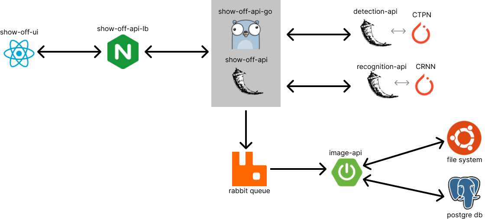
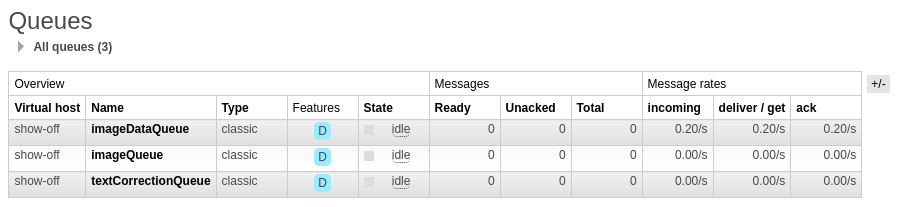

# Project: **show-off**

    
   
    
  

## About

This project is created for showing off and experimenting with my skills in fields of Software Development, Machine Learning and DevOps.

Implemented system and applications read text from supplied images and return extracted text from images. 
In essence this is an OCR application.

Application and it's Kubernetes cluster are hosted on Oracle Cloud ARM architecture server. Application itself can be found 
at [jmajaca.xyz/show-off](https://jmajaca.xyz/show-off). While APIs documentation is available [here](https://jmajaca.xyz:5000/).

> Note: Model for recognition of text from image is under-performing mostly because of dataset used to train it.
> As recognition model was not main focus of this project (it was whole system) I decided to release project and repo
> for public. Currently, I am trying to optimize performance of recognition model.

## Architecture



## Models

I decided to break OCR task in two sequential tasks: detection of text in image and recognition of words/characters on detected text.

For detection model used is CTPN and for recognition model used is CRNN.

### Connectioinst Text Proposal Network ([CTPN](https://arxiv.org/abs/1609.03605)) Model

This model can extract regions of text from supplied image. For my implementation I used existing implementations written with Pytorch.
From said implementation all was "scraped" except necessary parts of code for prediction. 
Alongside with implementation pretrained weights were also
downloaded from supplied GitHub repo. It was decided that this approach would be the best considering amount of pre- 
and post-processing of data required for
this model. Given the fact that this project tries to implement whole system opposed to one model also played a role in decision.

Using someone else's implementation proved to be excellent in context of time needed to develop whole system but pretty bad in context of speed.
In original paper authors claim that "the CTPN is computationally efficient with 0.14 s/image" while current implementation takes about 8 seconds per image
(with post- and pre-processing). One of future improvements is to implement model myself and optimise it's time per image.

Source code can be found in folder `detection/python/src/third_party`.

### Convolutional Recurrent Neural Network ([CRNN](https://arxiv.org/abs/1507.05717)) Model

This model can extract text from supplied image. Implementation was done with help of original paper and existing implementations
like one discussed in [this blog](https://deepayan137.github.io/blog/markdown/2020/08/29/building-ocr.html).

Model was trained on synthetic dataset and has poor generalization ability. Currently, process of searching for desired
dataset is in progress. In the meantime, weights trained on synthetic dataset are in use only to show whole system that
was designed.

On image bellow is shown value of loss function over epochs for validation dataset. Training stopped when validation loss
was greater than in last 5 epochs. Size of validation loss window is hyperparameter of optimization process.


Source code can be found in folder `recognition/python/model`.

## Microservices

| Name                 | Description                                                                | Language   | Framework   | Source code folder       |
|----------------------|----------------------------------------------------------------------------|------------|-------------|--------------------------|
| **show-off-ui**      | Frontend application that sends images to OCR process and displays results | TypeScript | React       | `show-off-ui`            |
| **show-off-api**     | Backend for Frontend (BFF) application                                     | Python     | Flask       | `show-off-api/python`    |
| **detection-api**    | CTPN Model wrapper for REST calls                                          | Python     | Flask       | `detection/python`       |
| **recognition-api**  | CRNN Model wrapper for REST calls                                          | Python     | Flask       | `recognition/python/api` |
| **image-api**        | Application that stores images and image data                              | Java       | Spring Boot | `image-api`              |
| **documentation-ui** | Frontend application for viewing documentation from all APIs at one place  | JavaScript | -           | `documentation-ui`       |

### show off ui

Frontend application implemented in TypeScript and React Framework. It's main task is sending images to backend and represent backends response.

Before sending image to backend via network application will resize image to have height of `720px` while image maintains
width to height ratio. Image will be also converted to `jpeg` format before being sent as `multipart/form-data`. All 
that ensures reduction of network traffic without significant (if any) loss of data. This could be further improved by 
providing option for user to explicitly mark his region of interest on photo so that only marked rectangle will be sent 
to backend (after compression). User marking region of image before sending it is in time of writing this marked as TODO task.

### show off api

Application that is designed as Backend for Frontend. It's main task is to dispatch requests (after processing them) on 
other APIs when request is received from frontend.

Other services with which this application interacts are detection-api and recognition-api for synchronous calls and 
three queues for asynchronous calls. If one of synchronous calls fails whole process fails and if one asynchronous 
processes fails it will have no impact on process itself. Asynchronous calls on queues are used to store data about 
image and it's data in form of text placement and extraction.

Documentation of API endpoints can be found [here](https://jmajaca.xyz:5000/#show-off-api).

### detection api

Application that is wrapper for detection model which exposes relevant endpoints via REST.

In future wrapper implementation in Golang is considered.

Documentation of API endpoints can be found [here](https://jmajaca.xyz:5000/#detection-api).

### recognition api

Application that is wrapper for recognition model which exposes relevant endpoints via REST.

In future wrapper implementation in Golang is considered.

Documentation of API endpoints can be found [here](https://jmajaca.xyz:5000/#recognition-api).

### image api

Application that handles saving image and its corresponding data.

Image and data is received via queue. There exists some methods exposed via REST API, but that are only for showing off. 
Image itself is stored on filesystem while the data received during OCR process is stored in database. There exists cron 
job responsible for deleting images and image related data if they are older than N=7 days.

Documentation of API endpoints can be found [here](https://jmajaca.xyz:5000/#image-api).

### documentation-ui

Frontend application implementation in plain JavaScript with no Framework. It uses one HTML file and one nginx configuration
for reverse proxy. Via this application one can see all API docs in one place.

Application can be found [here](https://jmajaca.xyz:5000).

## CI-CD

Complete pipeline is created that handles build and deploy to server on every push to one of the target branches. 
All runs of pipeline can be seen in projects [actions](https://github.com/jmajaca/show-off/actions) tab.
Product of build process is Docker image which is published to [DockerHub](https://hub.docker.com/u/spaladium).

### Argo

ArgoCD is used for GitOps-ing kubernetes resources. More information about this concrete implementation and use of 
ArgoCD can be found [here](https://github.com/jmajaca/show-off/blob/master/devops/README.md).


### Minikube

Minikube is used for operating Kubernetes cluster. Three namespaces are created: show-off, show-off-infra and argo. 
In argo namespace ArgoCD is installed, in show-off-infra rabbit queue and postgres database are located while all other 
microservices are in show-off namespace.


### GitHub Actions

GitHub actions is used for CI-CD. There exists one `yaml` file for declaring build and deploy process for every 
microservice which is triggered when branch associated with that microservice receives new commit. YAML file can be 
found [here](https://github.com/jmajaca/show-off/blob/master/.github/workflows/ci-cd.yaml).


## Infra

### Queue

There exists 3 queues: imageQueue, imageDataQueue and textCorrectionQueue. All queues have header with `request_id` parameter.

imageQueue takes binary data that represents image. imageDataQueue takes JSON with data from OCR process which contains 
placement of text on image and extracted text itself. textCorrectionQueue takes JSON with text correction value bind to 
request from header of request.



### database

Postgres database consist of following tables.


#### image

| name               | type      | description                                                   |
|--------------------|-----------|---------------------------------------------------------------|
| id                 | VARCHAR   | Primary key. UUID value which is image identification.        |
| path               | VARCHAR   | Path on filesystem to exact file in which the image is saved. |
| creation_timestamp | TIMESTAMP | The time when was image received to be saved.                 |

#### image_box

| name     | type    | description                                                 |
|----------|---------|-------------------------------------------------------------|
| id       | SERIAL  | unique autogenerated image_box identification               |
| start_x  | INTEGER | x-axis coordinate of starting point for box containing text |
| start_y  | INTEGER | y-axis coordinate of starting point for box containing text |
| width    | INTEGER | width of box that contains text                             |
| height   | INTEGER | height of box that contains text                            |
| text     | VARCHAR | text extracted from text box                                |
| image_id | VARCHAR | Foreign key. UUID value which is image identification.      |

#### text_correction

| name     | type    | description                                         |
|----------|---------|-----------------------------------------------------|
| id       | SERIAL  | unique autogenerated text_correction identification |
| value    | VARCHAR | text correction for image                           |
| image_id | VARCHAR | UUID value which is image identification.           |

## Networking

### Domain and SSL cert

Domain and SSL certificate were bought on [NameCheap](https://www.namecheap.com/) and installed on Ubuntu server. 

### nginx

Ports on Ubuntu server are exposed via nginx and reverse proxy. Configuration for application itself is following:

```
server {

    listen 443 ssl;
    
    ssl_certificate REDACTED;
    ssl_certificate_key REDACTED;
    
    server_name jmajaca.xyz;
    
    location / {
        proxy_pass http://REDACTED:30000/;
        proxy_set_header Host $host;
        proxy_set_header X-Real-IP $remote_addr;
        proxy_set_header X-Forwarded-For $proxy_add_x_forwarded_for;
        proxy_set_header X-Forwarded-Proto $scheme;
        proxy_set_header SSL_PROTOCOL $ssl_protocol;
    }

}

server {

        listen 80;

        server_name jmajaca.xyz www.jmajaca.xyz;

        return 301 https://jmajaca.xyz$request_uri;

}
```

## TODOs

- [ ] enable user to select region of interest in image before sending it
- [ ] improve detection model performance in terms of speed
- [ ] improve recognition model performance with training on better suited training dataset
- [ ] golang implementation of apis
- [ ] include test checks in CI-CD process
- [ ] write Networking section of documentation