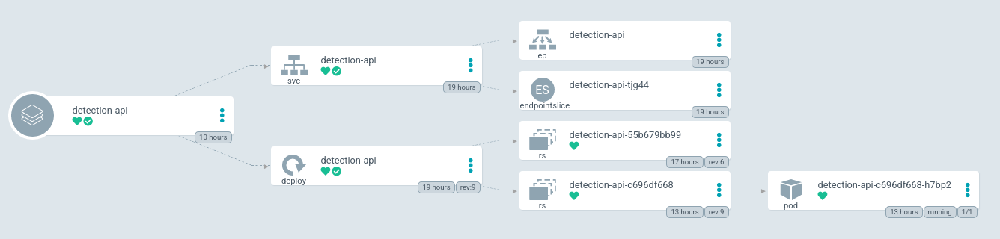

Minikube was installed following [official tutorial](https://minikube.sigs.k8s.io/docs/start/).

nginx reverse proxy was created to route traffic from default server http port `80` to `show-off-ui` service inside
kubernetes cluster. Script for initializing nginx configuration can be found in `devops/scripts/init_reverse_proxy.bash`
while configuration itself is located in `devops/configs/reverse_proxy.conf`. Setup was created with help of
[this tutorial](https://www.scaleway.com/en/docs/tutorials/nginx-reverse-proxy/).

CI-CD pipeline was created via GitHub actions. 
Resources for creating build part of pipeline can be found at 
[GitHub](https://github.com/marketplace/actions/build-and-push-docker-images#path-context),
[docs.docker](https://docs.docker.com/ci-cd/github-actions/) and
[blog.docker](https://www.docker.com/blog/docker-v2-github-action-is-now-ga/).
For deploy part of pipeline [this](https://github.com/appleboy/ssh-action) GitHub action was used.

## Volumes

Volume for pre-trained weights was created with command `minikube mount /var/kubernetes/show-off:/var/kubernetes &`.
Directory `/var/kubernetes/show-off` contains files: `CTPN.pth`.

## ArgoCD

[ArgoCD](https://argo-cd.readthedocs.io/en/stable/) is a declarative, GitOps CD tool for Kubernetes. It was installed on minikube cluster following 
[official tutorial](https://argo-cd.readthedocs.io/en/stable/getting_started/). Installation needed arm64 images
so some changes were made to default images. Following [this](https://github.com/argoproj/argo-cd/issues/4211#issuecomment-927183031)
comment `ghcr.io/dexidp/dex` was changed to `dexidp/dex` and `quay.io/argoproj/argocd` to `spaladium/argocd` which was
built based on official repository on local arm64 machine. Connecting ArgoCD and GitHub was done following instructions for
[GitHub](https://cloud.redhat.com/blog/private-git-repositories-part-2a-repository-ssh-keys#:~:text=Adding%20the%20Public%20Key%20to%20GitHub&text=Visit%20the%20Settings%20page%20for,file%20into%20the%20Key%20field.)
and for [ArgoCD](https://argo-cd.readthedocs.io/en/release-1.8/user-guide/private-repositories/).
ArgoCD syncs resources from this repository on branch `devops` in `devops` folder. That folder includes 3 main 
directories for argo:
- `namespace-apps` - resources of type `Application` that root [app of apps](https://argo-cd.readthedocs.io/en/stable/operator-manual/cluster-bootstrapping/)
syncs, these applications represent kubernetes namespaces
- `administration` - standard kubernetes resources with CDR `AppProject` that `namespace-apps` syncs, this folder includes
resources for given namespace and all applications in that namespace (positioned in `administration/<namespace>/applications`)
- `application` - standard kubernetes resources for given application that `administration/<namespace>/applications/<application>`
syncs

ArgoCD UI view on `detection-api` application and `show-off` namespace represented as Argo's CDR `Application`:

 


Here is how manifest of root app of apps called `platform` looks like:
```yaml
project: argocd
meta:
  name: platform
  namespace: argocd
source:
  repoURL: 'https://github.com/jmajaca/show-off.git'
  path: devops/namespace-apps
  targetRevision: devops
destination:
  server: 'https://kubernetes.default.svc'
syncPolicy:
  automated:
    prune: true
    selfHeal: true
  syncOptions:
    - CreateNamespace=true
    - ApplyOutOfSyncOnly=true
    - PruneLast=true
```